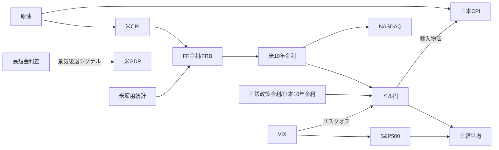

# 経済影響モデル（EIM: Economic Impact Model）全体設計

> ステータス: 設計案 v0.2（2026-09-29）— **日本株中心**に決定
> 前提: v1 ダッシュボード（`data/indicators.json`）のデータを入力として使う

## 1. 目的

**日本株（指数・保有銘柄）を目的変数**とし、海外市場・為替・金利・商品から日本株への**波及経路（何が、どれだけ、どのくらいの遅れで効くか）**を、データに基づいて定量化する。

- 市場全体の基準は **TOPIX** とする。日経平均は値がさの半導体・AI関連株の影響が大きく、2025–26年には TOPIX 連動ETF の日経平均βが 0.61（相関 0.86）にとどまったため。
- 農業経営の視点から、エネルギー・穀物先物（円換算）の**コスト面への波及**も扱う。

- 「ドル円が 1 円円高になると、日経平均は平均で何 % 動くか」（感応度）
- 「米金利の変化は、何日後にドル円へ最も強く現れるか」（ラグ）
- 「米金利 +0.5%・原油 +10% のシナリオでは、日本株と為替はどうなるか」（シナリオ）

**方針（実証主義）:** すべての係数に推定期間、標本数、信頼区間、検証期間での誤差を付ける。相関を因果関係として扱わない。

## 2. 想定する波及経路（仮説グラフ）

モデルで**検証する対象の仮説**であり、結論ではない。



## 3. レイヤー構成

```
┌─────────────────────────────────────────────────────────┐
│ ④ 表示層（GitHub Pages / JS）                           │
│   ヒートマップ・ラグ図・感応度表・シナリオシミュレータ   │
├─────────────────────────────────────────────────────────┤
│ ③ モデル層（Python / Actions）→ data/eim.json          │
│   相関 → ラグ分析 → 回帰（感応度） → VAR・インパルス応答 │
├─────────────────────────────────────────────────────────┤
│ ② 特徴量層（Python）                                    │
│   頻度そろえ・変化率化・定常化・外れ値処理              │
├─────────────────────────────────────────────────────────┤
│ ① データ層（v1 で実装済み）→ data/indicators.json      │
│   yfinance（日次） / FRED（月次・四半期） / e-Stat（予定） │
└─────────────────────────────────────────────────────────┘
```

重い計算（statsmodels）は Actions 上の Python で行い、ブラウザは結果の表示と線形シナリオの計算だけを担う。これまでのアプリと同様に、GitHub Pages だけで動く軽量な構成を保つ。

## 4. 特徴量層の設計

| 課題 | 対応 |
|---|---|
| 頻度の違い（日次と月次） | 市場系は日次・週次（金曜終値）で分析し、マクロ系と組み合わせる場合は月次（月末値または月平均）にそろえる |
| 株価などの非定常性 | 水準ではなく変化で扱う。価格は対数収益率 `ln(Pt/Pt-1)`、金利は差分（bp） |
| 休場日の違い（日米） | 前方補完はせず、両市場の共通営業日で結合する。日経平均は米国市場に1日遅れて反応するため、ラグ付きで扱う |
| 外れ値（コロナショックなど） | ±5σ でウィンソライズする。ショック期間を除外した場合の結果も併記する |
| 構造変化 | 全期間の推定に加えて、ローリング推定（窓 250 営業日）で係数の時間変化を確認する |

## 5. モデル層：段階的に高度化する

| Phase | 手法 | 出力 | 分かること |
|---|---|---|---|
| **1** | ピアソン／スピアマン相関、ローリング相関 | 相関行列、相関の推移 | どの指標が連動しているか、その関係が安定しているか |
| **2** | 相互相関（ラグ −20〜+20 日）、Granger 因果性検定 | 最大相関のラグ、p 値 | どちらが先に動くか（先行・遅行） |
| **3** | 多変量回帰（OLS、HAC 標準誤差） | 感応度 β ± 95% 信頼区間、R² | 「ドル円 1% ↑ → 日経 β% ↑」 |
| **4** | VAR（ベクトル自己回帰）＋インパルス応答関数 | ショックへの応答経路（信頼帯付き） | 波及の大きさ、遅れ、持続期間 |
| **5** | シナリオシミュレータ | 条件付き予測 | 「米金利 +50bp なら？」 |

**検証:** 期間を学習用と検証用に分けて（例：直近 1 年を検証用）、Phase 3 以降は検証期間の RMSE とナイーブ予測（変化なし）との比較を必ず出力する。ナイーブ予測に勝てないモデルは表示で明示する。

## 6. 出力データ形式（`data/eim.json` 案）

```jsonc
{
  "updated_at": "2026-09-29T00:00:00+00:00",
  "window": { "start": "2021-09-29", "end": "2026-09-28", "freq": "D", "n": 1180 },
  "correlation": { "keys": ["n225","usdjpy", "..."], "matrix": [[1, 0.42], [0.42, 1]] },
  "rolling_corr": { "n225|usdjpy": [["2024-01-05", 0.38], "..."] },
  "lead_lag": [ { "x": "us10y", "y": "usdjpy", "best_lag": 1, "corr": 0.31, "granger_p": 0.004 } ],
  "sensitivity": [
    { "target": "n225", "driver": "usdjpy", "beta": 0.62, "ci95": [0.51, 0.73],
      "r2": 0.18, "unit": "% per 1%", "oos_rmse": 1.12, "naive_rmse": 1.20 }
  ],
  "irf": { "shock": "us10y", "response": "usdjpy", "horizon": 20, "mean": [], "lo": [], "hi": [] }
}
```

## 7. 実装ロードマップ

| 段階 | 内容 | 追加するもの |
|---|---|---|
| v1 ✅ | ダッシュボード | `fetch_data.py`, `index.html` |
| v1.2 ✅ | 農業関連先物（原油・暖房油・天然ガス・穀物）、ローカルの保有株レポート（ルールベース、日経β・為替感応度）、YouTuber 最新動画 | `analysis.py`, `local_report.py`, `run_report.bat` |
| v1.1 | 日本CPI を月次化（e-Stat API）、TOPIX 指数の取得元を検討 | Secrets `ESTAT_APP_ID` |
| v2 | EIM Phase 1–2（相関・ラグ） | `scripts/eim.py`, `eim.html`（相関ヒートマップ・ラグ図） |
| v3 | EIM Phase 3（感応度）＋検証 | 感応度表、信頼区間の表示 |
| v4 | EIM Phase 4–5（VAR・シナリオ） | インパルス応答図、シナリオ入力画面 |

依存ライブラリの追加予定: `statsmodels`, `numpy`（v2 以降）

## 8. 未決定事項（相談が必要）

1. ~~EIM の主な対象~~ → **日本株中心**に決定（2026-09-29）。
2. **分析の頻度**：日次（市場の短期連動を見る）と月次（マクロとの関係を見る）のどちらを重視するか。両方の場合は別モデルにする。
3. ~~個別銘柄~~ → 保有株を対象にする。`portfolio/holdings.json`（ローカル専用）から読み込み、v1.2 で日経β・為替感応度を実装した。
5. **レポートの判定ルールの検証**：環境スコアが実際にその後のリターンと関係しているかどうかを、過去データでバックテストする（スコアを残すなら必須）。
4. **e-Stat API**：日本の月次データ（CPI・鉱工業生産など）を使う場合は、アプリID の取得が必要。
